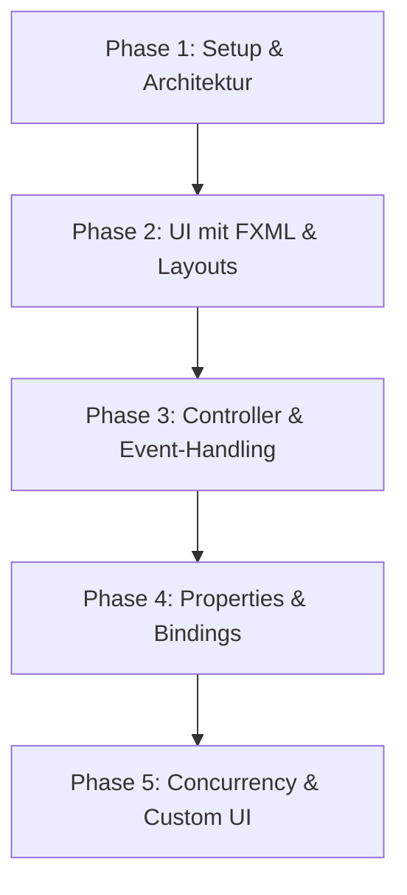

# Detaillierter Lernplan: JavaFX Zeiterfassungsverwaltung
Dieses Dokument dient als detaillierte Vorlage für die Erstellung eines praxisorientierten Tutorials für Fachinformatiker im 2. Lehrjahr (Schwerpunkt Anwendungsentwicklung). Das fortlaufende Projekt ist eine **Zeiterfassungsverwaltung** unter Verwendung des MVC-Musters und des DAO-Patterns.

---

## 🎯 Übergeordnete Zielsetzung des Tutorials
Am Ende des Tutorials haben die Lernenden eine vollständige, robuste JavaFX-Desktopanwendung programmiert, die eine lokale SQLite-Datenbank verwendet, Daten reaktiv bindet und zeitintensive Datenbankoperationen asynchron ausführt.

### Zielgruppe & Voraussetzungen
* **Zielgruppe:** Fachinformatiker (Anwendungsentwicklung / Systemintegration) im 2. Lehrjahr.
* **Voraussetzungen:** Solide Java-Grundlagen (OOP, Interfaces, Vererbung, Collections wie `List`/`Map`, Exceptions). Keine Vorkenntnisse in JavaFX oder JDBC erforderlich.

---

## 🗺️ Übersicht der Phasen



---

## 📂 Detaillierte Kapitelstruktur (Das Tutorial-Konzept)

---

### 📦 Phase 1: Projekt-Setup & Architektur (Die Basis)

#### 1. Projekt aufsetzen & Dependency Management
* **Lernziele:** 
  * Einrichten eines Multi-Modul- oder Standard-Maven-Projekts für JavaFX.
  * Verstehen der Modul-Struktur von Java (`module-info.java`).
* **Theorie:**
  * Was ist Maven? Warum nutzen wir `pom.xml`?
  * Einführung in das Java-Modulsystem (Jigsaw) ab Java 9. Warum braucht JavaFX `requires javafx.controls` und `opens ... to javafx.fxml`?
* **Praktische Umsetzung:**
  * Erstellen einer `pom.xml` mit folgenden Abhängigkeiten:
    * `javafx-controls`
    * `javafx-fxml`
    * `sqlite-jdbc` (für die Datenbankverbindung)
  * Konfiguration des `javafx-maven-plugin`.
* **Projektstruktur anlegen:**
  ```text
  src/main/java/de/zeiterfassung/
  ├── App.java
  ├── module-info.java
  ├── model/
  ├── database/
  └── controller/
  src/main/resources/
  └── fxml/
  ```

#### 2. Das Datenmodell (POJO)
* **Lernziele:**
  * Datenstrukturen für geschäftliche Anforderungen entwerfen.
  * Verwendung von modernen Java-Datentypen (`LocalDate`, `LocalTime`).
* **Theorie:**
  * Warum trennen wir Daten (Model) von der Logik?
  * Kapselung und Datenkonsistenz.
* **Praktische Umsetzung:**
  * Erstellen der Klasse `Zeiteintrag`:
    ```java
    package de.zeiterfassung.model;

    import java.time.LocalDate;
    import java.time.LocalTime;

    public class Zeiteintrag {
        private int id;
        private LocalDate datum;
        private LocalTime startzeit;
        private LocalTime endzeit;
        private String beschreibung;

        // Konstruktoren, Getter, Setter
    }
    ```

#### 3. Die relationale Datenbank & Verbindung
* **Lernziele:**
  * Einrichten einer lokalen, dateibasierten Datenbank (SQLite).
  * Schreiben eines Singleton-Musters für die Datenbankverbindung.
* **Theorie:**
  * JDBC-Grundlagen: Driver, Connection, Statement.
  * Warum SQLite? (Keine Server-Installation notwendig, ideal für Desktop-Apps).
* **Praktische Umsetzung:**
  * Klasse `DBConnection` implementieren, um eine Verbindung zu `jdbc:sqlite:zeiterfassung.db` aufzubauen.
  * Automatisches Erstellen der Tabelle `zeiteintrag` beim Anwendungsstart, falls sie nicht existiert.

#### 4. Das DAO-Pattern (Data Access Object)
* **Lernziele:**
  * Entkopplung der Datenhaltung von der Geschäftslogik durch Interfaces.
  * Schreiben von SQL-CRUD-Statements in Java.
* **Theorie:**
  * Das DAO-Muster als Standard-Enterprise-Pattern.
  * Schutz vor SQL-Injection mit `PreparedStatement`.
* **Praktische Umsetzung:**
  * Interface `ZeiteintragDAO` mit CRUD-Methoden definieren:
    ```java
    public interface ZeiteintragDAO {
        void save(Zeiteintrag eintrag) throws SQLException;
        List<Zeiteintrag> findAll() throws SQLException;
        void delete(int id) throws SQLException;
    }
    ```
  * Implementierung `SQLiteZeiteintragDAO` schreiben.

---

### 🎨 Phase 2: Die erste Oberfläche & FXML (Die View)

#### 5. Layout-Panes in JavaFX
* **Lernziele:**
  * Die wichtigsten Layout-Container von JavaFX verstehen und zielgerichtet einsetzen.
  * Responsive Ausrichtung von Oberflächenkomponenten.
* **Theorie:**
  * Layout-Manager-Prinzip: Warum absolute Positionierung out ist.
  * `BorderPane` (Regionen: Top, Bottom, Left, Right, Center).
  * `HBox` & `VBox` (Lineare Anordnung).
  * `GridPane` (Tabellarische Anordnung für Formulare).
* **Praktische Umsetzung:**
  * Entwurfsskizze der UI:
    * **Oben (Top):** Menüleiste (Datei -> Beenden, Info).
    * **Links (Left):** Eingabeformular (Datum picker, Startzeit, Endzeit, Beschreibung, Speichern-Button).
    * **Mitte (Center):** Tabelle (`TableView`) zur Anzeige der Einträge.

#### 6. Deklaratives UI-Design mit FXML & Scene Builder
* **Lernziele:**
  * Nutzen des Scene Builders für visuelles WYSIWYG-Design.
  * Struktur einer `.fxml`-Datei verstehen.
* **Theorie:**
  * Trennung von Deklaration (XML) und Logik (Java Controller).
* **Praktische Umsetzung:**
  * Erstellen der Datei `main_view.fxml` im Scene Builder.
  * Platzieren der Layout-Panes und Controls (Buttons, Labels, TableView, TableColumns).
  * Vorbereiten der Verknüpfungen (`fx:id` für UI-Elemente, `onAction` für Buttons).

#### 7. Starten der Applikation
* **Lernziele:**
  * Laden von FXML-Dateien zur Laufzeit.
  * Lebenszyklus einer JavaFX-Applikation (`start()`, `stop()`).
* **Praktische Umsetzung:**
  * Implementierung der `App`-Klasse, die von `Application` erbt:
    ```java
    public class App extends Application {
        @Override
        public void start(Stage primaryStage) throws Exception {
            FXMLLoader loader = new FXMLLoader(getClass().getResource("/fxml/main_view.fxml"));
            Parent root = loader.load();
            primaryStage.setTitle("Zeiterfassung Pro");
            primaryStage.setScene(new Scene(root, 900, 600));
            primaryStage.show();
        }
    }
    ```

---

### ⚙️ Phase 3: Controller & Event-Handling (Die Logik)

#### 8. Der Controller & FXML-Anbindung
* **Lernziele:**
  * Das Bindeglied zwischen FXML und Java-Logik erstellen.
  * Funktionsweise der Annotation `@FXML` verstehen.
* **Theorie:**
  * Instanziierung des Controllers durch den `FXMLLoader`.
  * Initialisierungs-Phase (`initialize()`-Methode).
* **Praktische Umsetzung:**
  * Erstellen von `MainController` und Zuordnung in der FXML: `fx:controller="de.zeiterfassung.controller.MainController"`.
  * Deklaration der FXML-Felder:
    ```java
    @FXML private DatePicker datePicker;
    @FXML private TextField txtStartzeit;
    @FXML private TextField txtEndzeit;
    @FXML private TextField txtBeschreibung;
    @FXML private Button btnSpeichern;
    ```

#### 9. Event-Handling & Einfache Validierung
* **Lernziele:**
  * Reaktionen auf Benutzerinteraktionen (z.B. Button-Klicks) programmieren.
  * Eingaben validieren und dem Benutzer Feedback geben.
* **Theorie:**
  * Event-Driven Programming in UIs.
  * Alert-Dialoge in JavaFX.
* **Praktische Umsetzung:**
  * Event-Handler für den Speichern-Button definieren: `public void onSpeichernClick(ActionEvent event)`.
  * Auslesen der Werte aus den Textfeldern, Parsen der Uhrzeiten (`LocalTime.parse()`), Fehlerbehandlung via Try-Catch.
  * Bei Erfolg: Instanziieren eines `Zeiteintrag`-Objekts und Aufruf von `dao.save(eintrag)`.

---

### 🪄 Phase 4: Properties, Bindings & Collections (Die JavaFX-Magie)

#### 10. Refactoring des Modells auf Properties
* **Lernziele:**
  * Reaktivität in Java-Objekten durch JavaFX-Properties implementieren.
* **Theorie:**
  * Warum reichen Standard-Getter/Setter nicht aus? (Der UI-Thread erfährt nichts von Änderungen im Objekt).
  * Das Observable-Pattern in JavaFX: `Property`, `ObservableValue`.
  * Das JavaFX Bean-Pattern (Getter, Setter, Property-Getter).
* **Praktische Umsetzung:**
  * Umbau von `Zeiteintrag`:
    ```java
    public class Zeiteintrag {
        private final IntegerProperty id = new SimpleIntegerProperty();
        private final ObjectProperty<LocalDate> datum = new SimpleObjectProperty<>();
        private final ObjectProperty<LocalTime> startzeit = new SimpleObjectProperty<>();
        private final ObjectProperty<LocalTime> endzeit = new SimpleObjectProperty<>();
        private final StringProperty beschreibung = new SimpleStringProperty();

        // Property Getter
        public StringProperty beschreibungProperty() { return beschreibung; }
        // Standard Getter/Setter
        public String getBeschreibung() { return beschreibung.get(); }
        public void setBeschreibung(String value) { this.beschreibung.set(value); }
    }
    ```

#### 11. TableView & TableColumns mit CellValueFactory
* **Lernziele:**
  * Tabellen in JavaFX dynamisch mit Daten befüllen.
  * Automatische Synchronisation zwischen Datenmodell und Spalten.
* **Theorie:**
  * Was ist eine `CellValueFactory`?
  * Verknüpfung von Spalten mit Property-Gettern des Modells.
* **Praktische Umsetzung:**
  * Deklaration der TableView im Controller:
    ```java
    @FXML private TableView<Zeiteintrag> tblEintraege;
    @FXML private TableColumn<Zeiteintrag, LocalDate> colDatum;
    @FXML private TableColumn<Zeiteintrag, LocalTime> colStart;
    @FXML private TableColumn<Zeiteintrag, LocalTime> colEnde;
    @FXML private TableColumn<Zeiteintrag, String> colBeschreibung;
    ```
  * In `initialize()`:
    ```java
    colDatum.setCellValueFactory(cellData -> cellData.getValue().datumProperty());
    colBeschreibung.setCellValueFactory(cellData -> cellData.getValue().beschreibungProperty());
    ```

#### 12. ObservableList als Datenquelle
* **Lernziele:**
  * Verwendung von reaktiven Collections zur automatischen UI-Aktualisierung.
* **Theorie:**
  * Eine `ObservableList` wirft Events bei jedem Add, Remove oder Update.
  * Die TableView horcht auf diese Events.
* **Praktische Umsetzung:**
  * Erstellen der Liste: `private final ObservableList<Zeiteintrag> eintragsListe = FXCollections.observableArrayList();`.
  * Verbinden mit der Tabelle: `tblEintraege.setItems(eintragsListe);`.
  * Beim Speichern: Objekt der Liste hinzufügen -> Tabelle aktualisiert sich ohne explizites `.refresh()` oder Neu-Laden!

#### 13. Deklarative UI-Steuerung über Bindings
* **Lernziele:**
  * Logische Bedingungen in der UI ohne `if-else` verknüpfen.
  * Zustände von Steuerelementen (z.B. Deaktivierung) an Daten binden.
* **Theorie:**
  * Unidirektionales vs. Bidirektionales Binding.
  * Die Hilfsklasse `Bindings` und Fluent API.
* **Praktische Umsetzung:**
  * Deaktivieren des Speichern-Buttons, wenn die Textfelder leer sind:
    ```java
    btnSpeichern.disableProperty().bind(
        txtStartzeit.textProperty().isEmpty()
        .or(txtEndzeit.textProperty().isEmpty())
        .or(txtBeschreibung.textProperty().isEmpty())
        .or(datePicker.valueProperty().isNull())
    );
    ```

---

### 🚀 Phase 5: Fortgeschrittene Konzepte & Concurrency

#### 14. Custom Rendering in ListViews & TableViews (CellFactory)
* **Lernziele:**
  * Komplexe UI-Elemente innerhalb von Listen formatieren.
  * Visuelle Hervorhebung basierend auf Datenwerten (z.B. Conditional Styling).
* **Theorie:**
  * Das Delegieren der Zellendarstellung an eine `CellFactory`.
  * Lebenszyklus einer Zelle: Die `updateItem`-Methode.
* **Praktische Umsetzung:**
  * Farbliche Hervorhebung von Zeiteinträgen, deren Arbeitsdauer weniger als 4 Stunden beträgt (Unterstunden-Warnung).
  * Schreiben einer anonymen Klasse / eines Lambdas für `colStart.setCellFactory(...)` oder eine separate `ListView` für Tagesübersichten.

#### 15. Multithreading in JavaFX (Concurrency)
* **Lernziele:**
  * Verhindern des Einfrierens der GUI bei langsamen I/O-Prozessen (Datenbank, API-Abfragen).
  * Korrekter Umgang mit dem *JavaFX Application Thread*.
* **Theorie:**
  * Single-Thread-Modell von modernen UI-Toolkits.
  * Warum `Platform.runLater()` wichtig ist, wenn Nicht-UI-Threads das UI manipulieren wollen.
  * Die JavaFX Concurrency API: `Task<V>` und `Service<V>`.
* **Praktische Umsetzung:**
  * Laden aller Zeiteinträge aus der SQLite-Datenbank beim Programmstart über einen Hintergrund-Task:
    ```java
    Task<List<Zeiteintrag>> loadTask = new Task<>() {
        @Override
        protected List<Zeiteintrag> call() throws Exception {
            // Simuliere Netzwerk-/DB-Verzögerung für Lerneffekt
            Thread.sleep(1000); 
            return dao.findAll();
        }
    };

    loadTask.setOnSucceeded(e -> {
        eintragsListe.setAll(loadTask.getValue());
        loadingOverlay.setVisible(false); // Lade-Indikator ausblenden
    });

    loadTask.setOnFailed(e -> {
        // Fehlerbehandlung im UI-Thread
    });

    new Thread(loadTask).start();
    ```

---

## 🏆 Transferaufgaben & Projekt-Erweiterungen (Für leistungsstarke Azubis)
Um dem Anspruch der Differenzierung gerecht zu werden, können am Ende des Tutorials folgende Erweiterungsaufgaben angeboten werden:
1. **Export-Funktion:** Export der gebuchten Zeiten in eine CSV- oder PDF-Datei.
2. **Statistik-Dashboard:** Anzeige einer Grafik (z. B. `BarChart` oder `PieChart`) zur Verteilung der Arbeitsstunden auf Projekte/Beschreibungen.
3. **Soll/Ist-Vergleich:** Eingabe einer wöchentlichen Sollarbeitszeit und visuelle Darstellung der Abweichung.

---

## 📝 Best Practices, die im Tutorial vermittelt werden
* **Clean Code:** Einheitliche Benennung von UI-Komponenten (z. B. Präfixe wie `btn`, `txt`, `col`, `tbl`).
* **Sicherheit:** Parameterisierte SQL-Queries, um SQL-Injections zu verhindern.
* **UX (User Experience):** Lade-Indikatoren (Spinner) bei asynchronen Operationen. Validierungs-Feedback vor dem Absenden.
* **Architektur:** Strikte Schichttrennung. Der Controller weiß nichts von SQL, er kennt nur das DAO-Interface.
